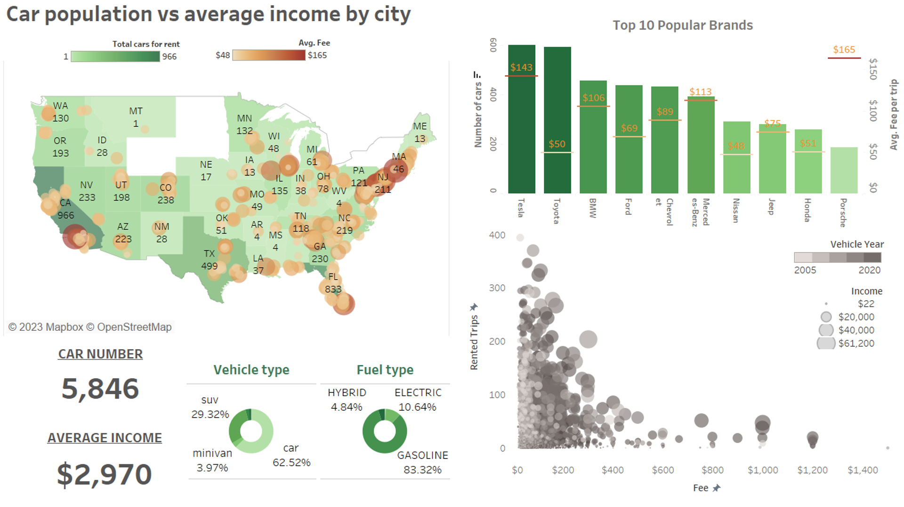
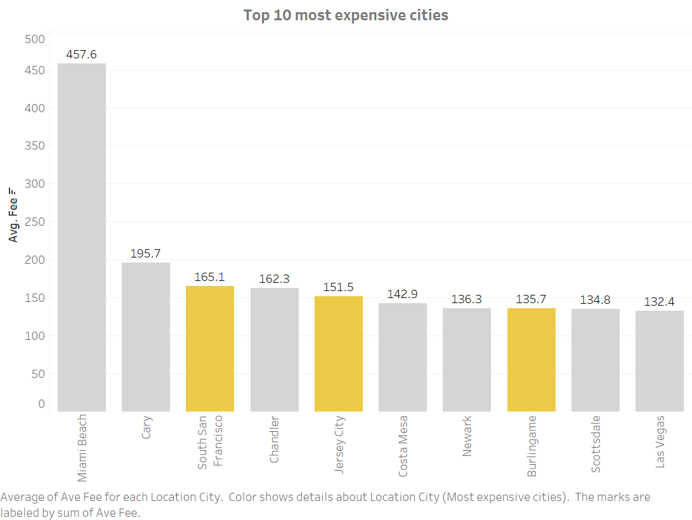
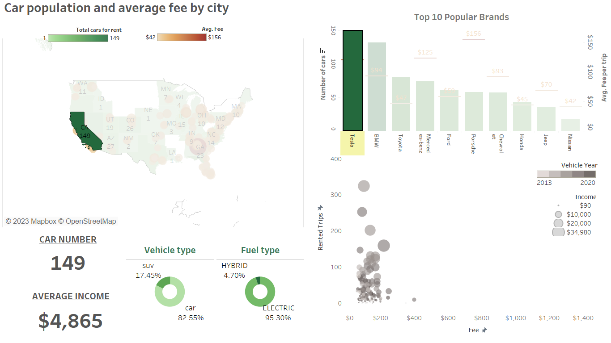

# Car-rental-analysis

As a student in data science, I worked on this project in my free time to explore Tableau and build a fun dashboard for an online car rental insight. Tableau nowadays has become industries standard for visualization, helping create beautiful graphs mostly by dragging and dropping, making it easier for people to explore and manage data. Here is what my result look like:

## Context

This dataset is originally from Kaggle (https://www.kaggle.com/datasets/kushleshkumar/cornell-car-rental-dataset ). The author scraped a popular peer-to-peer car sharing platform, built, and released this “Cornell Car Rental Dataset: A Dataset of 5,851 Cars” to the public in July 2020 . He already published some exploration of this dataset https://link.medium.com/Yduf7ceYC8 . 

As a new trend for modern life, car rental became a popular need, and car sharing system is good for business, people, and the environment. There is a rise in applications to meet this demand, therefore I found this dataset is interesting to build my ELT project to show some insights. Combining data Extract from Kaggle platform, Load in MySQL database and Transform in Tableau, this project shows a typical workflow of a Data Analyst. 

Imagine company A wants to launch a new marketing campaign to attract new cars to their market, therefore Product Manager wants to have an interactive dashboard showcase popularity of their app and average income for users. Moreover, it should provide more details information like most popular brands, fee and renting trend based on location… to help new users invest easier.

The original dataset has 5,851 cars available for rent in the US market. It included various fields such as Vehicle Brand, Model, Year, Daily Fare, Location Details and more in one big table. Firstly, a company will have many departments who store and manage different parts of their data, therefore I split data into 3 tables, set them up in MySQL local database: admin (fuel type, brand, model, owner…), location (longitude, latitude…) and performance (renting fee, review score, renting rate…), all of them linked by a unique car id. Data cleaning and preliminary analysis is carried out in MySQL Workbench. Secondly, a database is connected to Tableau to build visualization and dashboard.

## Discussion
Analysis showed the app is very popular with car owners in California, Texas, and Florida. Cars run by gas are unsurprisingly the most popular in the market (63%), however, SUV vehicles also take up a significant part (30%). Electrical vehicles are getting more popular recently and in fact, Tesla is the most popular brand on the market. The most expensive cities to rent included big cities like Miami, Las Vegas… However, its suburbs or town between big cities like Jersey City, Newark, South San Francisco while are still in top expensive, also still very popular to be rented. Perhaps people here have higher renting need to visit its big neighbor cities than the one who already in there.

In most cases, renting fee is between 20 – 200 USD and the cheaper the price the more rent it has. Renting fee depends a lot on the brands, location but also from age of the vehicle (the lighter dots lying mostly on the left axis represent the older cars with cheaper price). Luxury sport cars like Ferrari or Lamborghini can generate big income in big cities like Miami or Vegas, since their fees are relatively high (>700 USD) , however, are not always stable because a small fluctuation in trips can affect strongly on income. Good income must be a balance between fee (60-150 USD) and renting rate (>70 trips). 
If users want to invest their personal cars for renting on the flatform and they would want a more detailed information at their cities/states. This is when the interactive dashboard becomes useful. For example, a user who lived in California can click on the state location in map and directly got the state statistic (Pic.3). This state seems to have more expensive brands than average, but Tesla is still the most popular brand on the market. Continue choosing Tesla bar will show only number of this brand in California: it has lower fee than the country’s average (122 < 144 USD), but higher income than the state’s average (4,865 > 3,935 USD), the demand for this brand seems high in big cities like San Francisco or Los Angeles, especially if their price is only around average (100 – 140 USD). On the contrast, in small cities like Costa Mesa or Santa Ana, this brand doesn’t have high renting rate nor income, probably because electrical charge stations are not well distributed here. 

## Conclusion

In the real world scenario, this will be the first prototype dashboard and will need to be  tested and reviewed by many responsible before launching for users. 

This dashboard and visualization are created by Tableau, with an open-source dataset integrated in MySQL warehouse. 

The source code is shared at my GitHub: https://github.com/HoangAn0112/Car-rental-analysis

Interactive dashboard is deployed at Tableau Online: https://public.tableau.com/app/profile/an.hoang1517/viz/Carrentalinsight/Dashboard1

